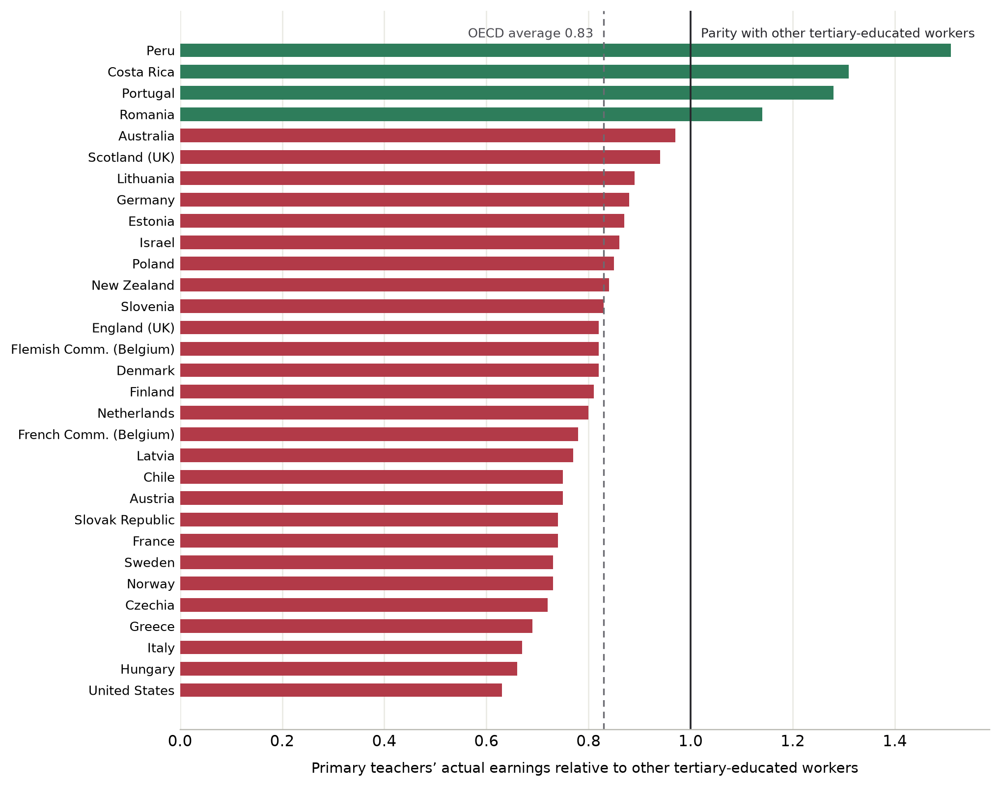

# 2. Why teachers leave

Policies that seek to bring former teachers back to the classroom can succeed only if they rest on the reasons for which those teachers left, and respond to them. The reasons decide who is reachable, at what cost, and with which instrument, and they are the subject of this section.

The departures themselves can be grouped broadly into resignations towards other employment, withdrawals from the labour market and retirements, and each responds to different instruments. How much any given reason weighs in these decisions varies from one system to another with the institutions that govern it, among them the design of pensions and the age at which they can be drawn, the pay of teachers relative to other tertiary-educated workers, the effective right to work part-time, parental leave and the reservation of the post, the inspection regime and the rules of licensure.

The reasons studied in the research literature fall into six areas, and the evidence behind them is distributed unevenly. Causal or quasi-experimental estimates exist for pay, for pensions and for inspection. School leadership and pupil behaviour are supported by evidence on observed departures. Professional purpose, standing and family reasons rest almost entirely on what teachers themselves report.

## 2.1 Patterns of departure

Teachers leave everywhere, at rates that differ several-fold between systems. Across the 19 OECD education systems with comparable data, 6.5% of fully qualified teachers left the profession in 2022/23, from around 2% in Israel, Ireland, France and Greece to around 12% in Lithuania and Denmark (OECD, 2025a).

Departure follows the shape of the career. It is most frequent in the first years of teaching, falls through mid-career and rises again as retirement approaches, a profile documented across the 46 studies of an early systematic review (Guarino, Santibañez and Daley, 2006).

Where a teacher works predicts departure better than who the teacher is. Pooling 120 studies, school working conditions are more strongly associated with attrition than teachers' personal characteristics; teachers in schools with better conditions face roughly half the odds of leaving, and class size shows no association at all (Nguyen et al., 2020). Within those conditions, the support of the school's leadership counts for more than material resources. In England, the leadership factor halves an experienced teacher's annual probability of leaving the profession (Sims and Jerrim, 2020), and in New York City, schools that improved their leadership, expectations and safety over time saw turnover fall within the same school (Kraft, Marinell and Shen-Wei Yee, 2016).

The reasons teachers give in surveys do not always coincide with the ones that predict their observed departure. The gap is the one to be expected between stated and revealed preferences (Samuelson, 1938), and it runs through the whole of the evidence considered here; Section 2.4 returns to it.

## 2.2 Classifying the reasons

The literature offers no single classification of these reasons. Some work separates what pushes a teacher out of the classroom from what attracts them towards other employment. Other work distinguishes what belongs to the teacher's life, what depends on the school and what is fixed by general rules, such as pay or pensions.

Drawing on that literature, this paper orders the reasons into six areas, defined by the domain to which each belongs and by the authority with the capacity to intervene in it. Table 1 lists them, and the remainder of the section examines each area together with the institutional variation that gives it more or less weight in a given country.

**Table 1. Reasons for leaving teaching, by area**

| Area | Reasons |
|---|---|
| Professional factors | Loss of professional purpose; limited autonomy over the work; professional standing; exposure to parental complaint and legal risk |
| Working conditions | Hours and total workload; pupil behaviour and classroom discipline; administrative and documentation demands; limited access to reduced hours; burnout and exhaustion |
| Organisational factors | School leadership; collegial support and team structure |
| Accountability and regulation | External inspection and its consequences; certification and licensing requirements |
| Financial factors | Pay relative to outside options; pension design and its timing incentives; contract insecurity |
| Personal and life-course factors | Family formation and care; health and incapacity; relocation and a partner's circumstances; retirement and career stage |

Source: Authors' elaboration on the literature reviewed in this section.

## 2.3 The reasons and their institutional setting

Asked in their own words, the reason leavers name most often is the loss of commitment to the work itself. In Finland, a longitudinal survey of teachers who declared an intention to leave found a lack of professional commitment named ahead of workload and interpersonal difficulty, far more often by men, while women cited workload and conflicts (Räsänen et al., 2020), although the survey follows declared intentions and not observed exits.

Professional standing, and the exposure that accompanies its loss, pushes departures in some systems. In Korea, early retirements of teachers rose from 869 in 2005 to 6 594 in 2021, a rise official research attributes above all to the infringement of teachers' rights, including exposure to parental complaint and legal action (KEDI, 2023).

Workload is the reason most declared nearly everywhere the question is asked. Among Dutch teachers who had recently left, 47% named workload, stress and burden ahead of every other category (Van Casteren et al., 2023). How much of that load a teacher can lawfully shed varies enormously between systems. A Dutch employer must grant a request for fewer hours unless a weighty business interest prevents it, and two thirds of Dutch lower-secondary teachers work part-time; Japanese teachers, who hold no such entitlement, are at 7% (OECD, 2025c); an English teacher holds a right to ask that a school may refuse on eight statutory grounds (United Kingdom, 1996).

In England, TALIS 2018 responses were linked to the administrative register of the school workforce to study the effective determinants of departure, and not only the declared ones, by observing who had left the profession a year after answering the survey.^1 Experienced teachers who work in schools with worse discipline leave more, and the magnitude is considerable, since a one-standard-deviation improvement in the school's discipline climate is associated with a halving of the annual probability of leaving the profession, while self-reported working hours, the motive most cited in surveys, do not predict departure robustly (Sims and Jerrim, 2020).

School leadership is the reason most often associated with departure and among the hardest to isolate, because head teachers are not assigned to schools at random, schools with better heads differ in pupils, resources and staff, and teachers who choose to stay tend to rate their head more favourably (Kraft, Marinell and Shen-Wei Yee, 2016). The panel evidence cited above, which follows change within the same school, is the closest the field has come to isolating it.

Young teachers are more likely to remain in their school if they are mentored by an older teacher at the start of their career. In observational research, those who receive mentoring leave less often (Nguyen et al., 2020), and England's evaluation of the Early Career Framework estimated 4.4 additional percentage points of retention in the original school after two years (Walker et al., 2024).

Whether to keep teaching is a decision each teacher takes by comparing what the post offers with the best that same person could obtain outside it. That outside option differs with the subject taught, the qualification held and the local labour market, which is why a single pay scale produces very different exit rates across subjects and regions. Where pay has been tested causally, money retains. Targeted payments to teachers in shortage subjects or disadvantaged schools reduced departure by between 9% and 23% in England, Florida, North Carolina and Norway, though the effect has lasted only as long as the payment itself (See et al., 2020). Behind those margins sits the level. In most OECD countries primary teachers earn less than the average tertiary-educated worker, at 83% of that benchmark on average, from 63% in the United States to 128% in Portugal (Figure 1).

**Figure 1. Primary teachers earn less than other tertiary-educated workers in most countries**

Note: Ratio of the annual average actual salary of full-time primary teachers in public institutions, including bonuses and allowances, to the earnings of full-time, full-year workers with tertiary education aged 25 to 64. Countries absent from the chart do not report the series. Data refer to 2024 or the nearest available year.
Source: OECD (2025), Education at a Glance 2025, Table D3.2.

Salary trajectories after leaving differ systematically by destination. Those who remain within the education sector experience small salary changes; those who abandon it face a far more dispersed distribution of outcomes, with thick tails at both ends, and the upper tail is concentrated among men and among shortage specialisations. United States tax records show mean earnings still slightly below pre-exit teaching pay eight years after departure, with the top quartile of employed leavers out-earning nearly all of those who stayed (Brummet et al., 2024); in Florida, the ratio of the ninetieth to the fiftieth percentile of earnings rose from 1.3 to 1.8 among leavers to other industries and was unchanged among those who moved within the sector (Chingos and West, 2012). Danish register data and Australian panel data agree in direction, at around 6% below previous pay (ROCKWOOL Fonden, 2025; Cuervo and Vera-Toscano, 2025). England is the partial exception, where leavers out-earn their own last teaching salary and still fall behind comparable teachers who stayed (Worth and McLean, 2022).

In most pension schemes covering teachers, retiring before the age the rules set reduces the pension, and retiring later barely increases it. Teacher retirements therefore cluster around that age, which is a parameter of the regulation and not of individual preferences. Pension wealth does not accumulate at the same pace across a career. In defined-benefit schemes it grows slowly through most of the career, very fast in the years immediately before the full-pension age, and hardly at all afterwards, so that one more year of work can be worth a great deal at 54 and almost nothing at 60 (Costrell and Podgursky, 2009). The profile is not particular to the United States. Accrual concentrated around rule-set ages is documented in the civil-service schemes of Germany, France, Spain, Portugal and Austria and in the legacy schemes of England and Ontario, while notional and funded defined-contribution systems, as in Sweden, Australia and post-reform Norway, are close to actuarially neutral and spread retirements accordingly (OECD, 2025e). Teachers anticipate these incentives, and retirements concentrate at the ages from which retiring stops being penalised (Ni and Podgursky, 2016).

When early retirement carries a pension reduction, teachers postpone it. France's 2003 reform priced early claiming for public servants, and retirement at ages 60 and 61 among teachers fell by around 9 percentage points in the study that exploits it (Baraton, Beffy and Fougère, 2011); Dutch public employees born after a cut-off date that lowered pension wealth postponed their expected retirement (Montizaan, Cörvers and de Grip, 2010). Germany offers the same picture descriptively. After deductions of up to 10.8% were introduced in 2001 for incapacity retirement before the age of 63, the share of teacher retirements taken on incapacity grounds fell from 64% to 28% within three years, and the mean retirement age of teachers rose by three years to 62 (Statistisches Bundesamt, 2005), although the series records a coincidence in time with the reform and not an estimated effect.

From an economic perspective, a teacher's lifetime income has two parts, the salary collected while working and the pension collected after retirement. The future pension is an incentive to remain in teaching only to the extent that the teacher values it today, and that valuation and the cost of funding the promise need not coincide. If teachers heavily discount income that lies decades ahead, the state pays dearly for an instrument that retains little, and the same money would retain more if paid as current salary. The evidence leaves the question open. When Illinois teachers were offered the chance to buy additional pension rights at a stated price, their willingness to pay was about 20 cents per dollar of present value (Fitzpatrick, 2015); following the same cohort to retirement points to a much higher valuation (Ni, Podgursky and Wang, 2022); and the quasi-experimental record finds little retention response to pension generosity outside the late career (Koedel and Xiang, 2017; Quinby and Wettstein, 2021).

The birth of a child is one of the main reasons female teachers leave. In England, where the workforce census can follow teachers after maternity leave, between 17% and 20% of those who return leave the profession within a year, double the rate of comparable teachers, and women aged 30 to 39 form the largest group among those who leave (Department for Education, 2023).^2 Structural modelling attributes much of the fall in teachers' labour-force participation after certification to marriage and fertility, and two thirds of exiting female teachers left the labour market altogether (Stinebrickner, 2001; Stinebrickner, 2002). A causal estimate of the effect of childbirth on teacher exit and return does not yet exist in any OECD system.

Paid maternity leave and the reservation of the post vary considerably across countries. A Spanish teacher on a permanent public contract has nineteen weeks of paid leave and may take up to three years of childcare leave per child, the first two with her post reserved (Government of Spain, 2015; Government of Spain, 2025); a teacher in the United States is guaranteed twelve unpaid weeks under federal law, and fewer than one in five large districts pay parental leave (United States, 2013; National Council on Teacher Quality, 2026).

The proportion between resignations and retirements varies widely across countries. In the 19 OECD systems with comparable data, resignations account for 51% of departures; they exceed 80% in Denmark, England and Estonia, and retirements predominate in France, Greece, Ireland and Israel (OECD, 2025a). The thesis that retirement is a minor component of attrition comes from the Anglophone systems and does not generalise.

## 2.4 Stated and revealed preferences

Teachers who leave declare workload and personal circumstances as their principal motives and place salary in the middle of the list. Teachers who are considering leaving place salary at or near the top. Observed decisions respond strongly to salary variation. Among American leavers, higher pay is the fourth most-cited main reason, at 9.5%, behind retirement, personal life and another job (NCES, 2024); among those considering leaving it is second, at 60% (Doan et al., 2023). English leavers cite pay at 25% to 34% against 74% to 84% for workload (Department for Education, 2024), Dutch leavers rank it sixth at 22% (Van Casteren et al., 2023), and across twelve discrete-choice experiments in eight countries a 10% pay increase raises the probability of choosing a post by 5 to 12 percentage points (Sims, Lowes-Belk and Routledge, 2026). The contrast between stated and revealed preferences is therefore drawn in this paper on realised exits, and not on plans.

Many more teachers say they will leave than do. Where intention and behaviour have been measured on the same people, one leaves for every three or four who declare the intention. In a nationally representative American survey of 102 970 teachers linked to the following year's behaviour, 32.5% of those intending to leave as soon as possible had left a year later, against 6.8% of everyone else, and two thirds of them were still teaching (Nguyen et al., 2025). The 17% of teachers across TALIS systems who intend to leave within five years cannot for that reason be read against the 6.5% annual rate of departure; the two measure different things (OECD, 2025b; OECD, 2025a).

## 2.5 Destinations after leaving

Most of those who leave teaching keep working in the education sector, and former teachers are therefore locatable through the records of employers and regulators. In the United States, linked tax records show more than half of leavers still in education broadly defined and about one fifth out of the labour force (Brummet et al., 2024); the first-year composition is similar in Australia (Cuervo and Vera-Toscano, 2025), and most English leavers who do not retire take education-sector jobs (Worth, Bamford and Durbin, 2015).

The population of former teachers is large wherever it has been counted, and the gross count overstates the usable reserve, which discounts expired certificates and specialisations without vacancies. Michigan holds 141 810 certified teachers, of whom 61 252 do not teach in a public school, and half of those hold expired certificates (Lindsay, Gnedko-Berry and Wan, 2021); the Netherlands counts some 62 000 qualified teachers outside education, four times its measured secondary shortage (Somers et al., 2024b). What a return offer can expect depends on why each person left. In Scotland, most of the teachers interviewed at length had left after an accumulation of pressures with no single trigger, and with their vocational commitment intact (Hulme et al., 2026). It is to that population, and to the instruments aimed at it, that the next section turns.

## Notes

1. TALIS is the OECD's international survey of teachers and school leaders in primary and lower secondary education. In its 2018 round, 73% of surveyed English teachers consented to having their responses linked to the School Workforce Census, the annual administrative register of the staff of England's state-funded schools, and the matching produced 2 684 linked records at a match rate of 84%. The analysis, commissioned by the Department for Education, is Sims and Jerrim (2020), https://www.gov.uk/government/publications/talis-2018-teacher-working-conditions-turnover-and-attrition.
2. The maternity-return figures are Department for Education ad hoc statistics for 2016-2019 reported to Parliament; the original statistical release should be verified before publication.

## References

- Baraton, M., M. Beffy and D. Fougère (2011), "Une évaluation de l'effet de la réforme de 2003 sur les départs en retraite : Le cas des enseignants du second degré public", *Économie et Statistique*, No. 441-442, pp. 55-78, https://doi.org/10.3406/estat.2011.9615.
- Brummet, Q., E. K. Penner, N. Pharris-Ciurej and S. R. Porter (2024), "The earnings and labor market trajectories of teachers who leave the profession", *Educational Evaluation and Policy Analysis*, Vol. 47/2, pp. 503-531, https://doi.org/10.3102/01623737241227906.
- Chingos, M. M. and M. R. West (2012), "Do more effective teachers earn more outside the classroom?", *Education Finance and Policy*, Vol. 7/1, pp. 8-43, https://doi.org/10.1162/EDFP_a_00052.
- Costrell, R. M. and M. Podgursky (2009), "Peaks, cliffs, and valleys: The peculiar incentives in teacher retirement systems and their consequences for school staffing", *Education Finance and Policy*, Vol. 4/2, pp. 175-211, https://doi.org/10.1162/edfp.2009.4.2.175.
- Cuervo, H. and E. Vera-Toscano (2025), "Teacher attrition in Australia: Evidence of labour market and wage outcomes from longitudinal data", *Australian Journal of Education*, https://doi.org/10.1177/00049441251341603.
- Department for Education (2023), *School Workforce in England: Ad Hoc Statistics on Maternity Leave and Returns*, Department for Education, London. [Release to be verified before publication.]
- Department for Education (2024), *Working Lives of Teachers and Leaders: Wave 3 and Wave 4 Reports*, Department for Education, London, https://www.gov.uk/government/publications/working-lives-of-teachers-and-leaders.
- Doan, S., E. D. Steiner, R. Pandey and A. Woo (2023), *Teacher Well-Being and Intentions to Leave: Findings from the 2023 State of the American Teacher Survey*, RR-A1108-8, RAND Corporation, Santa Monica, CA, https://www.rand.org/pubs/research_reports/RRA1108-8.html.
- Fitzpatrick, M. D. (2015), "How much are public school teachers willing to pay for their retirement benefits?", *American Economic Journal: Economic Policy*, Vol. 7/4, pp. 165-188, https://doi.org/10.1257/pol.20140087.
- Government of Spain (2015), *Real Decreto Legislativo 5/2015, de 30 de octubre, por el que se aprueba el texto refundido de la Ley del Estatuto Básico del Empleado Público*, Article 89, Boletín Oficial del Estado, Madrid, https://www.boe.es/eli/es/rdlg/2015/10/30/5/con.
- Government of Spain (2025), *Real Decreto-ley 9/2025, de 29 de julio, por el que se amplía el permiso por nacimiento y cuidado del menor*, Boletín Oficial del Estado, Madrid.
- Guarino, C. M., L. Santibañez and G. A. Daley (2006), "Teacher recruitment and retention: A review of the recent empirical literature", *Review of Educational Research*, Vol. 76/2, pp. 173-208, https://doi.org/10.3102/00346543076002173.
- Hulme, M. et al. (2026), "Teacher turnover in Scotland: Reluctant leavers, downscaling, and the limits of voluntary exit", *Oxford Review of Education*, https://doi.org/10.1080/03054985.2026.2709882.
- KEDI (2023), *Survey Evidence on Teacher Attrition and the Infringement of Teachers' Rights*, Korean Educational Development Institute, Jincheon. [Full bibliographic details to be completed before publication.]
- Koedel, C. and P. B. Xiang (2017), "Pension enhancements and the retention of public employees", *ILR Review*, Vol. 70/2, pp. 519-551, https://doi.org/10.1177/0019793916650452.
- Kraft, M. A., W. H. Marinell and D. Shen-Wei Yee (2016), "School organizational contexts, teacher turnover, and student achievement: Evidence from panel data", *American Educational Research Journal*, Vol. 53/5, pp. 1411-1449, https://doi.org/10.3102/0002831216667478.
- Lindsay, J., N. Gnedko-Berry and C. Wan (2021), *Michigan Teachers Who Are Not Teaching: Who Are They, and What Would Motivate Them to Teach?*, REL 2021-076, Regional Educational Laboratory Midwest, Institute of Education Sciences, Washington, DC, https://ies.ed.gov/ncee/edlabs/projects/project.asp?projectID=4592.
- Montizaan, R., F. Cörvers and A. de Grip (2010), "The effects of pension rights and retirement age on training participation: Evidence from a natural experiment", *Labour Economics*, Vol. 17/1, pp. 240-247, https://doi.org/10.1016/j.labeco.2009.09.002.
- National Council on Teacher Quality (2026), *Paid Parental Leave for Teachers: State and District Policies*, NCTQ, Washington, DC, https://www.nctq.org/research-insights/how-many-school-districts-offer-paid-parental-leave/.
- NCES (2024), *Teacher Attrition and Mobility: Results from the 2021-22 Teacher Follow-up Survey*, National Center for Education Statistics, Washington, DC, https://nces.ed.gov/pubsearch/pubsinfo.asp?pubid=2024039.
- Nguyen, T. D., L. D. Pham, M. Crouch and M. G. Springer (2020), "The correlates of teacher turnover: An updated and expanded meta-analysis of the literature", *Educational Research Review*, Vol. 31, 100355, https://doi.org/10.1016/j.edurev.2020.100355.
- Nguyen, T. D. et al. (2025), "Teacher turnover intentions and actual turnover: Evidence from nationally representative data", *AERA Open*. [Full bibliographic details to be completed before publication.]
- Ni, S. and M. Podgursky (2016), "How teachers respond to pension system incentives: New estimates and policy applications", *Journal of Labor Economics*, Vol. 34/4, pp. 1075-1104, https://doi.org/10.1086/686263.
- Ni, S., M. Podgursky and F. Wang (2022), "How much are public school teachers willing to pay for their retirement benefits? Comment", *American Economic Journal: Economic Policy*, Vol. 14/3, pp. 478-493, https://doi.org/10.1257/pol.20200763.
- OECD (2025a), "What is the profile of the teaching workforce and how has it evolved?", in *Education at a Glance 2025: OECD Indicators*, Indicator D8, Table D8.4, OECD Publishing, Paris, https://doi.org/10.1787/f7b0b326-en.
- OECD (2025b), *Results from TALIS 2024*, OECD Publishing, Paris.
- OECD (2025c), *Results from TALIS 2024, Country Notes: Japan, France and the Netherlands*, OECD Publishing, Paris, https://doi.org/10.1787/e127f9e2-en.
- OECD (2025d), "How much are teachers and school heads paid?", in *Education at a Glance 2025: OECD Indicators*, Indicator D3, Table D3.2, OECD Publishing, Paris, https://doi.org/10.1787/1c0d9c79-en.
- OECD (2025e), *Pensions at a Glance 2025: OECD and G20 Indicators*, OECD Publishing, Paris.
- Quinby, L. and G. Wettstein (2021), "Do deferred benefit cuts for current employees increase separation?", *Labour Economics*, Vol. 73, 102081, https://doi.org/10.1016/j.labeco.2021.102081.
- Räsänen, K., J. Pietarinen, K. Pyhältö, T. Soini and P. Väisänen (2020), "Why leave the teaching profession? A longitudinal approach to the prevalence and persistence of teacher turnover intentions", *Social Psychology of Education*, Vol. 23/4, pp. 837-859, https://doi.org/10.1007/s11218-020-09567-x.
- ROCKWOOL Fonden (2025), *Folkeskolelærere, der forlader deres job, går ned i løn og søger mod job med færre sygemeldinger*, ROCKWOOL Fondens Forskningsenhed, Copenhagen, https://rockwoolfonden.dk/. [Full working-paper reference to be confirmed.]
- Samuelson, P. A. (1938), "A note on the pure theory of consumer's behaviour", *Economica*, Vol. 5/17, pp. 61-71, https://doi.org/10.2307/2548836.
- See, B. H., R. Morris, S. Gorard and N. El Soufi (2020), "Teacher recruitment and retention: A critical review of international evidence of most promising interventions", *Education Sciences*, Vol. 10/10, 262, https://doi.org/10.3390/educsci10100262.
- Sims, S. and J. Jerrim (2020), *TALIS 2018: Teacher Working Conditions, Turnover and Attrition*, Statistical Working Paper, Department for Education, London, https://www.gov.uk/government/publications/talis-2018-teacher-working-conditions-turnover-and-attrition.
- Sims, S., B. Lowes-Belk and A. Routledge (2026), "Teacher preferences for pay and working conditions: A systematic review of discrete-choice experiments", *Economics of Education Review*. [Full bibliographic details to be completed before publication.]
- Somers, M. et al. (2024b), *De stille reserve aan leraren buiten het onderwijs*, ROA, Maastricht University, Maastricht, https://roa.maastrichtuniversity.nl/.
- Statistisches Bundesamt (2005), *Lehrkräfte gehen mit durchschnittlich 62 Jahren in Pension*, press release, Destatis, Wiesbaden. [Archived release to be obtained before publication.]
- Stinebrickner, T. R. (2001), "A dynamic model of teacher labor supply", *Journal of Labor Economics*, Vol. 19/1, pp. 196-230, https://doi.org/10.1086/209985.
- Stinebrickner, T. R. (2002), "An analysis of occupational change and departure from the labor force: Evidence of the reasons that teachers leave", *Journal of Human Resources*, Vol. 37/1, pp. 192-216, https://doi.org/10.2307/3069608.
- United Kingdom (1996), *Employment Rights Act 1996*, Part 8A (Flexible Working), sections 80F-80G, as amended, London, https://www.legislation.gov.uk/ukpga/1996/18/part/8A.
- United States (2013), *Family and Medical Leave Act Regulations*, 29 CFR Part 825, Subpart F, Washington, DC, https://www.ecfr.gov/current/title-29/subtitle-B/chapter-V/subchapter-C/part-825/subpart-F.
- Van Casteren, W. et al. (2023), *Vertrekredenen leraren en docenten in het po, vo en mbo*, ResearchNed, Nijmegen, https://www.voion.nl/publicaties/vertrekredenen-leraren-en-docenten-in-het-po-vo-en-mbo/.
- Walker, M. et al. (2024), *Evaluation of the Early Roll-out of the Early Career Framework: Evaluation Report*, National Foundation for Educational Research for the Education Endowment Foundation, London, https://d2tic4wvo1iusb.cloudfront.net/production/documents/projects/ECF_early_year_rollout_evaluation_report.pdf.
- Worth, J., S. Bamford and B. Durbin (2015), *Should I Stay or Should I Go? NFER Analysis of Teachers Joining and Leaving the Profession*, National Foundation for Educational Research, Slough, https://www.nfer.ac.uk/publications/should-i-stay-or-should-i-go-nfer-analysis-of-teachers-joining-and-leaving-the-profession.
- Worth, J. and D. McLean (2022), *The Impact of Training Bursaries on Teacher Recruitment and Retention: An Analysis of Teachers' Pay and Financial Incentives*, National Foundation for Educational Research, Slough, https://www.nfer.ac.uk/. [Exact report title to be confirmed against the earnings analysis cited.]
