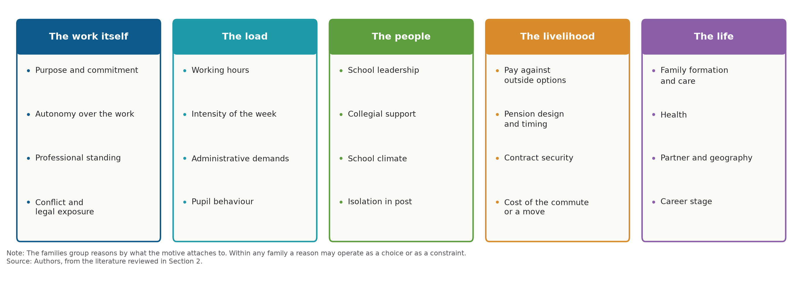
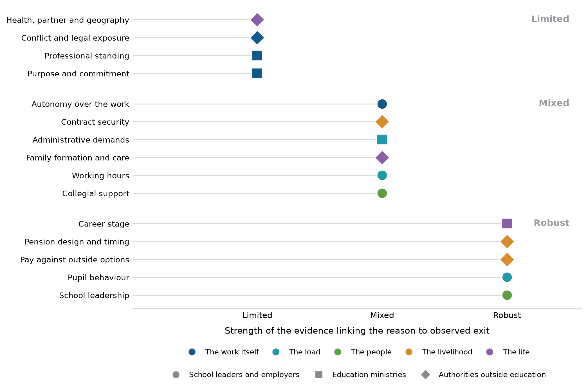

# 2. Why teachers leave

## 2.1 Patterns of departure

Education systems that seek to draw teachers back into the classroom need to know why those teachers left. Teachers leave in numbers that owe little to any shortage of qualified people and a good deal to the conditions of the schools they work in. Departure clusters at the two ends of a career, running high in the first years and rising again as retirement approaches, and it falls unevenly across schools, with the highest rates where pupils are poorest. Pay matters, though it matters less than public debate assumes and mainly at the point of entry; the people a teacher works with and the conditions of the work matter more; and what teachers say drove them out is not always what predicts who actually goes.

Teachers leave particular schools far more often than they leave teaching altogether. Around 15% of American teachers moved or left each year, most of them qualified people departing for reasons other than retirement, and the conditions of the school predicted who went once the characteristics of teachers and of their pupils were held constant (Ingersoll, 2001). The estimate came from a single survey wave and cannot carry a causal reading, although the finding has held wherever it has been retested, and staffing difficulty has since been treated as a problem attached to employers.

Two moments in a career account for most of the outflow. Teachers leave heavily in their first five years, and again as a pension comes within reach, a shape recovered from 46 mainly American studies and confirmed in every later test (Guarino, Santibañez and Daley, 2006). Where a teacher works explains more of this than who a teacher is. Across 120 studies, teachers over 28 hold 30% lower odds of leaving their school, better working conditions cut the odds by nearly half, and neither smaller classes nor additional adults in the classroom show any association at all (Nguyen et al., 2020).

What a teacher reports as a reason and what predicts that teacher's departure are not the same thing. In England, where survey answers have been matched to administrative records of who subsequently left, school leadership and pupil behaviour predicted observed exit while self-reported workload did not (Sims and Jerrim, 2020). Comparable linkage exists in no other system, and across some 70 antecedents an association changes strength according to whether the outcome measured is an intention or a departure (Gundlach, Slemp and Hattie, 2024).

Some reasons are easier to see than others, and the reporting categories decide which. Those categories descend from studies of employee turnover written between 1958 and 1986, which divided correlates into personal, work-related and external, and which every later education taxonomy inherits (March and Simon, 1958; Cotton and Tuttle, 1986; Nguyen and Springer, 2021). Pay, supervision, hours and the composition of a workplace are recorded by employers and can be put to an employee in a questionnaire. A teacher who leaves because the work no longer permits what they believe teaching is for has no box in those lists.

Rigorous evaluation, meanwhile, has concentrated on money. Weighting 120 experimental and quasi-experimental studies by the strength of their design shows that targeted payments bring people into teaching without durably keeping them there, and that almost nothing rigorous exists on workload, working conditions, pupil behaviour or leadership (See et al., 2020).

## 2.2 Classifying the reasons

A paper about re-entry asks of every reason for leaving whether the condition that produced the exit still holds when a return is offered, and who would have to act to change it. The frameworks in general use answer neither, because each was built for another question.

Push and pull sorts reasons by the direction of the force acting on the person. The original scheme distinguished factors at the origin and at the destination, intervening obstacles and personal factors, and observed that one factor may repel one person and attract another (Lee, 1966); the two-term version in common use has no independent content, since anything correlated with leaving can be relabelled a push. Sorting instead by where a variable sits in a regression gives boundaries that will not travel, because salary counts as an external correlate only where districts set it (Nguyen et al., 2020).

Job demands and resources supplies the mechanism those lists lack, since it sorts conditions into demands that deplete and resources that motivate (Demerouti et al., 2001), although its evidence is almost wholly cross-sectional and about intention, and its categories cannot hold a moral reason for leaving. The leaver typologies classify something else again, either by crossing the desire to leave with control over it, or by separating exits triggered by a shock from those that accumulate without one (Hom et al., 2012; Lee and Mitchell, 1994). Neither can supply the reasons themselves.

Three things these schemes leave out matter for re-entry policy, namely the loss of professional meaning and standing, the difference between a departure chosen and one forced by circumstance, and whether the condition that produced the exit still exists when a return is offered. Grouping reasons by what the motive attaches to keeps all three in view. The work itself covers purpose, autonomy, standing and exposure to conflict or legal risk; the load covers hours, intensity, administrative demands and pupil behaviour; the people covers school leadership, collegial support and school climate; the livelihood covers pay against outside options, pension design and contract security; and the life covers family formation and care, health, geography and career stage (Figure 1). Nothing in that arrangement ranks one reason above another.

**Figure 1. The reasons teachers leave, grouped by what the reason attaches to**

Note: The families group reasons by what the motive attaches to. Within any family a reason may operate as a choice or as a constraint.

Source: Authors, from the literature reviewed in Section 2.

Two properties order what the grouping leaves flat. The first is the strength of the evidence linking a motive to observed exit and not to what teachers say they will do; the second is who holds the instrument, since a motive owned by school leaders and one owned by a pension authority are not the same policy object (Figure 2). Placed this way, the reasons with the strongest behavioural evidence sit with school leaders and employers, while the reasons that dominate public debate sit where the evidence is mixed or where ministries cannot act alone.

**Figure 2. The same reasons, ordered by the strength of the evidence on observed exit**

Note: Placement reflects this review of the evidence and is not derived from a common statistical model. The horizontal axis records the strength of the evidence linking each reason to observed exit and not to stated intention; the marker shape records the authority holding the primary instrument; the colour records the family in Figure 1.

Source: Authors, from the literature reviewed in Section 2.

Within any of these a motive can operate as a choice or as a constraint, and the distinction decides what a return offer can expect. A teacher who left because no part-time post existed, or because a move followed a partner, remains available on terms the system controls. One who left because the work lost its purpose does not return for a better timetable.

## 2.3 The reasons and their institutional setting

Where leavers are asked in their own words, the loss of professional meaning comes out as the largest single category, and it is the one the variable taxonomies have no box for, though the interpretive tradition treats it as structural to teaching (Kelchtermans, 2017). Finland gives the clearest reading of it, because Finnish teachers hold unusual autonomy and are paid adequately, so the complaint left once material grievances are subtracted is about purpose. Followed over five years, half of Finnish comprehensive-school teachers reported turnover intentions, and the largest group named a lack of commitment to the goals that had guided their career choice, ahead of workload and interpersonal difficulty (Räsänen et al., 2020). Latin American research reaches the same place from a very different setting, where what ends early careers is the encounter with the daily political reality of school life (González-Escobar et al., 2020).

Professional standing belongs with purpose, because both concern the terms on which the work is done and not its volume. Korea is the system in which the mechanism became visible, because a national controversy over parental complaint gave teachers a name for it, and survey work there attributes the rise in departures principally to the infringement of teachers' professional rights, with early retirements standing at 869 in 2005 and at 6 594 in 2021 (KEDI, 2023). The threat in question comes from parents and from the law.

What a government does about that exposure is itself a variable, and two systems have done opposite things. Korea answered with statute, amending four acts on the protection of teachers' rights in September 2023, within nine weeks of the death of a first-year teacher in Seoul, and widening the definition of an infringement in 2026 to cover a single malicious complaint (Republic of Korea, 2023). Japan answered the same pressures by repricing time, since teachers there are paid a flat allowance in lieu of overtime, so their overtime is neither paid nor counted; the 2025 revision of the *kyūtokuhō* lifts that allowance, fixed at 4% for half a century, to 10% by 2031 in a system whose lower-secondary teachers report 55.1 hours a week against an OECD average of 41 (OECD, 2025c). Neither instrument has been evaluated against exit, so the link between legal standing and departure is not established.

Workload is the reason teachers give most often, wherever they are asked. Among Dutch teachers who had recently left, 47% named workload, stress and burden ahead of every other category (Van Casteren et al., 2023), and it stands second among Australian leavers and first among Swedish ones (Brandenburg et al., 2024; Statistics Sweden, 2023).

The behavioural evidence does not support that ordering. Where survey responses have been linked to who actually left, workload bears an inconsistent relationship to attrition, and in one specification hours worked are associated with a 33% reduction in the odds of attrition, the opposite of the expected sign and a result the authors call inconclusive (Sims and Jerrim, 2020). Leadership and pupil behaviour, entered in the same models, do predict observed exit. The reconciliation is probably compositional, because the association between hours and wellbeing is non-linear and task-specific, with marking a source of work-related stress and total hours not (Jerrim and Sims, 2021).

How much room a teacher has to cut hours instead of leaving is set by law, and the law varies more sharply here than anywhere else in this section. A Dutch employer must grant a request to work fewer hours unless a weighty business interest prevents it, and a request left unanswered past the deadline is deemed granted, so two thirds of Dutch lower-secondary teachers work part-time; Japanese teachers, who have no such entitlement, are at 7% (OECD, 2025c). England confers only a right to ask, refusable on eight statutory grounds that include cost and the difficulty of reorganising work among existing staff (United Kingdom, 1996). Nobody has estimated what part-time access does to teacher exit, and German evidence cuts the other way, since among 5 905 part-time teachers fewer hours alone did not improve mental health and 42% still intended to retire early (Seibt and Kreuzfeld, 2023).

Pupil behaviour is the load motive with the strongest behavioural evidence behind it. A one-standard-deviation improvement in a school's discipline climate halves an experienced English teacher's annual probability of leaving the profession, to 0.5% (Sims and Jerrim, 2020), and across TALIS systems stress from student intimidation and from maintaining discipline is more closely associated with intending to leave than stress from workload or accountability (OECD, 2025b). Because the instrument sits with the school and not with a ministry, the variation that matters runs between schools within a system and not between countries.

Wellbeing enters through burnout, where the two measurement traditions disagree. Meta-analyses of self-report scales make burnout the dominant predictor of wanting to leave, the larger pooling 94 studies covering 39 508 teachers (Madigan and Kim, 2021; Li and Yao, 2022), though both rest on cross-sectional data and measure intention. Population comparisons and objective measures find something narrower. Eleven United Kingdom survey datasets give little evidence that teachers have worse mental health than other occupations (Jerrim et al., 2020), biomarker data show no association between teaching and physical health (Sims et al., 2022), and leavers report being happier in their work while their mental health does not improve (Jerrim, Sims and Taylor, 2021).

Teaching appears to be a job many are glad to leave without being one that damages them. Whether the damage presents as an exit depends on what the system offers instead, which is why Japan counts its casualties in leave, with more than 7 000 public-school staff on mental-health sick leave in 2023 (MEXT, 2024).

School leadership is the most consistently replicated finding in the field and the least well identified. Among the contextual factors measured in New York City, perceptions of the school administration have the greatest influence on retention (Boyd et al., 2011), and a panel design following change within the same school finds improvements in leadership, in expectations and in safety each independently associated with lower turnover (Kraft, Marinell and Shen-Wei Yee, 2016). In England the leadership factor halves an experienced teacher's annual probability of leaving (Sims and Jerrim, 2020). No study anywhere estimates what changing a school's leadership does to retention.

What teachers mean by leadership support varies with how the employer is organised, which is why the same finding surfaces in different vocabulary. Danish leavers describe leaders who put municipal targets ahead of professional support, because the 2013 reform of teachers' working time made the head the enforcer of a clock (Böwadt, Vaaben and Pedersen, 2016), whereas German research points to the absence of team structure, because German schools organise teaching as solo work (Universität zu Köln and Katholische Hochschule NRW, 2026). Two neighbouring motives that teachers price highly are barely detectable in exit records at all. Autonomy over professional development is the dimension most strongly associated with intending to stay in England (Worth and Van den Brande, 2020), and a collegial atmosphere raises the probability of choosing a job by 33 percentage points in job-choice experiments (Sims, Lowes-Belk and Routledge, 2026), yet neither predicts who actually leaves (Sims and Jerrim, 2020).

Induction and mentoring are where the correlational and the experimental literatures point in opposite directions. Observational studies associate them with lower attrition among beginning teachers (Nguyen et al., 2020), whereas the largest randomised trial, covering 17 districts and 1 009 teachers, found no effect on retention in any of three follow-up years (Glazerman et al., 2010), and weighting studies by design quality leaves no consistent positive effects among the stronger ones (See et al., 2020). Where designs disagree in this way, the experimental result governs.

Pay is the best-identified motive and the one whose policy reading is most contested. Four quasi-experiments agree that targeted money moves retention. A Norwegian premium of about 10% for schools with a history of vacancies cut voluntary quits by 6 percentage points (Falch, 2011); a North Carolina bonus for mathematics and science teachers in high-poverty schools lowered turnover in the target group by about 17% (Clotfelter et al., 2008); English payments of GBP 2 000 a year after tax made eligible mathematics and physics teachers 23% less likely to leave (Sims and Benhenda, 2022); and Florida's loan forgiveness cut attrition by around a tenth, with no effect in the years it was underfunded (Feng and Sass, 2018).

Read against the whole class of studies the lever is narrower, since incentives must offset both the disadvantage of the school and the opportunity cost of a better-paid occupation before they do anything, and the effect lasts only while the payment does (See et al., 2020). In observational data the pooled association between salary and attrition is close to nothing (Nguyen et al., 2020).

Leavers, moreover, do not on the whole leave for money. Danish register data show teachers leaving the *folkeskole* for jobs paying about DKK 2 000 a month less, with a probability of sick leave 12 percentage points lower (ROCKWOOL Fonden, 2025).

What pay means to a teacher depends on what that teacher could earn elsewhere, and the gap is nowhere near constant. Measured against the earnings of tertiary-educated workers in full-time, full-year employment, primary teachers earn 37% less in the United States and 28% more in Portugal, against an OECD average of 17% less (OECD, 2025d). The tempting inference, that the salary motive weighs more heavily where the gap is worse, does not survive the cases. Polish relative pay is better than the OECD average and Polish leavers nonetheless rank pay first, while Portugal, at the top of the ratio, has under a fifth of its teachers satisfied with their salaries (OECD, 2025b). Whether exit responds more strongly to pay where the outside option is better has never been estimated across countries.

Pension design is a distinct lever, because it fixes the date at which leaving becomes financially attractive. Accrual in defined-benefit teacher plans is highly non-linear. It spikes in the mid-to-late fifties and then flattens or turns negative, so the same rules pull a teacher towards a date and push them past it (Costrell and Podgursky, 2009), and teachers respond in a forward-looking way (Ni and Podgursky, 2016).

How they value that deferred pay is disputed. An offer to buy additional benefits at a stated price implied that employees would pay about 20 cents for a dollar of present-value pension wealth (Fitzpatrick, 2015), whereas tracking the same cohort to retirement showed that most did buy the upgrade, and that those who declined faced a negative net benefit given their timing (Ni, Podgursky and Wang, 2022); a stated-preference experiment puts the premium at 2% to 3% of salary (Fuchsman, McGee and Zamarro, 2023). The 20-cent figure is not a settled parameter.

The same lever has been pulled the other way outside the United States, and the German case is the clearest. Deductions of up to 10.8% for retirement on grounds of incapacity before the age of 63 were introduced in 2001; the share of teacher retirements taken on incapacity grounds, 64% in the year before the change, was 28% by 2004, and the mean retirement age of teachers rose by three years to 62 (Statistisches Bundesamt, 2005). That is an official series around a policy date and not an evaluation, so it establishes a coincidence in time with an obvious candidate cause.

No European study yet prices the effect for teachers, though a Dutch reform that cut pension wealth only for workers born in 1950 and later did postpone expected retirement across the public sector (Montizaan, Cörvers and de Grip, 2010).

How much of leaving belongs to the life course is a national parameter and not a constant. Across 19 OECD systems 51% of leavers resigned and the remainder retired, but more than 80% resigned in Denmark, England and Estonia, whereas retirements account for over half of departures in France, Greece, Ireland and Israel (OECD, 2025a). The proposition that retirement is a minor part of the problem is an Anglophone one. Nor is age the only demographic reading that has to be localised, since women were reported more likely to leave than men in the 2008 synthesis (Borman and Dowling, 2008) whereas pooling 37 studies finds no difference at all (Nguyen et al., 2020), and any difference that persists lies in the reasons, because Finnish men name a lack of commitment far more often than women, and Finnish women name workload and interpersonal strain (Räsänen et al., 2020).

The life-course reason with the largest policy stake rests on the oldest evidence in this section. That about two-thirds of exiting female teachers left the labour force entirely, with a newborn child the dominant factor, comes from a cohort of American women who left school in 1972 (Stinebrickner, 2002), and no recent administrative study in any OECD system estimates the effect of childbirth or care on teacher exit and return. The gap is immediate for a paper about re-entry, because a teacher on a career break and one permanently gone cannot at present be sized apart.

What the law does around that event varies more than almost anything else here. A Spanish *funcionaria de carrera* has nineteen fully paid and non-transferable weeks, raised from sixteen in 2025, and may then take three years of *excedencia* for each child, with the post reserved for two years and seniority preserved (Government of Spain, 2015; Government of Spain, 2025), so that in law childbirth interrupts her career without ending it. The federal floor in the United States is twelve unpaid weeks, fewer than a fifth of the largest districts pay for parental leave, and the rules for school employees let a district hold a teacher who begins leave near the end of a term on unpaid leave until it ends (United States, 2013; National Council on Teacher Quality, 2026).

The same event carries opposite institutional consequences. No study links either regime to teacher exit or return, so the contrast establishes a difference in legal exposure and not in outcomes.

## 2.4 Stated and revealed reasons

Three kinds of evidence about the same decision give three different answers. Asked in their own words why they left, teachers rarely put pay first; asked to choose between hypothetical jobs, they respond to pay strongly; followed into administrative records, they turn out to have taken a pay cut.

The three reconcile if pay is a powerful attribute at the margin of choice and a weak narrative reason, so that people do not say they left for money and do respond to it when offered. What leavers say is informative about the ordering within a system and misleading across systems. Pay ranks sixth among Dutch leavers, named by 22% of them (Van Casteren et al., 2023), and first among Polish teachers who had already left (Związek Nauczycielstwa Polskiego, 2026). The rank of pay tracks the national wage level and not the causal structure, so a cross-country league table of stated reasons is not a comparison of causes.

Choice experiments price what open-response surveys cannot. Across twelve studies in eight OECD countries a 10% increase in pay raises the probability of choosing a job by 5 to 12 percentage points (Sims, Lowes-Belk and Routledge, 2026). Dutch teachers working part-time require a 23% increase in net hourly wages before accepting a full-time post, which puts a price on a proposal often made without one (Somers et al., 2024a).

Intention is the most used of the three and the least reliable. Intentions linked to observed turnover a year later, across three waves of a nationally representative American survey of 102 970 teachers, put the exit rate of those intending to leave as soon as possible at 32.5% against 6.8% for everyone else (Nguyen et al., 2025). The relative gap is wide, although the absolute reading runs the other way, because two-thirds of those intending to leave were still teaching the following year and the correlation between intent and behaviour is 0.15. Stated intention overstates realised one-year exit by a factor of roughly three to four where both are measured on the same population.

English inspection gives the same ratio from the other end, because England has both a discrete published judgement and a linked workforce census. Thirty per cent of surveyed teachers reported having considered leaving after their last inspection (Perryman et al., 2025), whereas an inadequate judgement raises turnover by 3.4 percentage points, about a quarter of average turnover, with no effect from an outstanding one (Sims, 2016). Finland, which abolished its inspectorate in 1991 and evaluates samples of pupils with non-binding findings, has no comparable rule to estimate, and half of its comprehensive-school teachers hold turnover intentions all the same (Räsänen et al., 2020). Light-touch accountability therefore cannot be shown to lower attrition, since the two systems differ on entry selectivity, status, class size and pay, and the one cross-national estimate of the accountability-stress association is explicitly modest (Jerrim and Sims, 2022). The graded judgement behind the English estimate was abolished in September 2024.

Two consequences follow for reading a national survey of leaving intentions. Such data locate dissatisfaction across countries and school types without forecasting supply, so the 17% of non-retiring teachers who intend to leave within five years across TALIS systems (OECD, 2025b) cannot be set against an annual attrition rate of 6.5% (OECD, 2025a) as though the two measured one thing. Nor is the reason a teacher gives a stable property of that teacher, since only 40% of Finnish teachers with turnover intentions named the same factor five years apart, although the intention itself persisted for 62% of them (Räsänen et al., 2020). A survey answer identifies what was salient on the day it was given.

## 2.5 Destinations after leaving

Most teachers who leave do not leave education. Linked administrative and tax records in the United States show more than half of leavers still in education broadly defined, about a fifth out of the labour force, and mean earnings below their pre-exit level eight years afterwards (Brummet et al., 2024). Australian panel data give a similar first-year composition, with 22.1% in non-teaching roles within school education and 21.8% in other education, health and social assistance work (Cuervo and Vera-Toscano, 2025), and in England most non-retiring leavers take education-sector jobs at an average wage some 10% below comparable stayers (Worth, Bamford and Durbin, 2015). The modern former teacher is usually still employed and often still inside education, so the population is reachable through employer and regulator records.

That population is large wherever anyone has counted it. Michigan holds 141 810 certified teachers of whom 61 252 were not teaching in a public school, and roughly half of those held expired certificates against 6% of active teachers (Lindsay, Gnedko-Berry and Wan, 2021). The Netherlands has roughly 62 000 qualified teachers outside education, some four times its measured secondary shortage (Somers et al., 2024b), in the system whose teachers already have the widest access to reduced hours.

What a return offer can expect depends on why the person went. Interviews with 63 Scottish teachers found most departures accumulating over months or years without a discrete trigger, and more than two-thirds of those interviewed leaving with their vocational commitment intact, because the conditions of the work had become untenable; a further group cut their hours or gave up promoted posts without leaving, a movement no standard classification records (Hulme et al., 2026).

Where the exit was compelled in this sense, the person remains available. Four in five Dutch leavers said they could have been retained had certain things been different (Van Casteren et al., 2023), and about half of Swedish former teachers would consider returning, though what they ask for is more time to teach (Statistics Sweden, 2023).

A departure that resolved a failure of purpose is a different proposition, because the condition that produced it does not change when a timetable does. The instruments governments use to bring former teachers back address whether a return is permitted, what it pays, what the job looks like, and whether the offer reaches the person it is meant for. That record is now long enough to read.

## NEW REFERENCES TO ADD

- Böwadt, P. R., N. K. Vaaben and R. Pedersen (2016), *Hvorfor stopper lærerne i folkeskolen?*, Professionshøjskolen UCC (now Københavns Professionshøjskole), Copenhagen, https://www.ucviden.dk/.
- Borman, G. D. and N. M. Dowling (2008), "Teacher attrition and retention: A meta-analytic and narrative review of the research", *Review of Educational Research*, Vol. 78/3, pp. 367-409, https://doi.org/10.3102/0034654308321455.
- Boyd, D. et al. (2011), "The influence of school administrators on teacher retention decisions", *American Educational Research Journal*, Vol. 48/2, pp. 303-333, https://doi.org/10.3102/0002831210380788.
- Cotton, J. L. and J. M. Tuttle (1986), "Employee turnover: A meta-analysis and review with implications for research", *Academy of Management Review*, Vol. 11/1, pp. 55-70, https://doi.org/10.5465/amr.1986.4282625.
- Demerouti, E. et al. (2001), "The Job Demands-Resources model of burnout", *Journal of Applied Psychology*, Vol. 86/3, pp. 499-512, https://doi.org/10.1037/0021-9010.86.3.499.
- Falch, T. (2011), "Teacher mobility responses to wage changes: Evidence from a quasi-natural experiment", *American Economic Review*, Vol. 101/3, pp. 460-465, https://doi.org/10.1257/aer.101.3.460.
- Fuchsman, D., J. B. McGee and G. Zamarro (2023), "Teachers' willingness to pay for retirement benefits: A national stated preferences experiment", *Economics of Education Review*, Vol. 92, 102349, https://doi.org/10.1016/j.econedurev.2022.102349.
- González-Escobar, M. et al. (2020), "Abandono docente na América Latina: revisão da literatura", *Cadernos de Pesquisa*, Vol. 50/176, pp. 592-604, https://doi.org/10.1590/198053146706.
- Government of Spain (2015), *Real Decreto Legislativo 5/2015, de 30 de octubre, por el que se aprueba el texto refundido de la Ley del Estatuto Básico del Empleado Público*, Article 89, Boletín Oficial del Estado, Madrid, https://www.boe.es/eli/es/rdlg/2015/10/30/5/con.
- Government of Spain (2025), *Real Decreto-ley 9/2025, de 29 de julio, por el que se amplía el permiso por nacimiento y cuidado del menor*, Boletín Oficial del Estado, Madrid.
- Guarino, C. M., L. Santibañez and G. A. Daley (2006), "Teacher recruitment and retention: A review of the recent empirical literature", *Review of Educational Research*, Vol. 76/2, pp. 173-208, https://doi.org/10.3102/00346543076002173.
- Gundlach, H. A. D., G. R. Slemp and J. Hattie (2024), "A meta-analysis of the antecedents of teacher turnover and retention", *Educational Research Review*, Vol. 44, 100606, https://doi.org/10.1016/j.edurev.2024.100606.
- Hom, P. W. et al. (2012), "Reviewing employee turnover: Focusing on proximal withdrawal states and an expanded criterion", *Psychological Bulletin*, Vol. 138/5, pp. 831-858, https://doi.org/10.1037/a0027983.
- Hulme, M. et al. (2026), "Teacher turnover in Scotland: Reluctant leavers, downscaling, and the limits of voluntary exit", *Oxford Review of Education*, https://doi.org/10.1080/03054985.2026.2709882.
- Ingersoll, R. M. (2001), "Teacher turnover and teacher shortages: An organizational analysis", *American Educational Research Journal*, Vol. 38/3, pp. 499-534, https://doi.org/10.3102/00028312038003499.
- Jerrim, J. and S. Sims (2021), "When is high workload bad for teacher wellbeing? Accounting for the non-linear contribution of specific teaching tasks", *Teaching and Teacher Education*, Vol. 105, 103395. [Volume and article number to be confirmed.]
- Jerrim, J. and S. Sims (2022), "School accountability and teacher stress: International evidence from the OECD TALIS study", *Educational Assessment, Evaluation and Accountability*, Vol. 34, pp. 5-32, https://doi.org/10.1007/s11092-021-09360-0.
- Jerrim, J. et al. (2020), "How does the mental health and wellbeing of teachers compare to other professions? Evidence from eleven survey datasets", *Review of Education*, Vol. 8/3, pp. 659-689, https://doi.org/10.1002/rev3.3228.
- Jerrim, J., S. Sims and H. Taylor (2021), "I quit! Is there an association between leaving teaching and improvements in mental health?", *British Educational Research Journal*, Vol. 47/5, pp. 1226-1248, https://doi.org/10.1002/berj.3720.
- KEDI (2023), *Survey Evidence on Teacher Attrition and the Infringement of Teachers' Rights*, Korean Educational Development Institute, Jincheon. [Reference reached this review through secondary reporting; full bibliographic details to be completed before publication.]
- Kelchtermans, G. (2017), "'Should I stay or should I go?': Unpacking teacher attrition/retention as an educational issue", *Teachers and Teaching*, Vol. 23/8, pp. 961-977, https://doi.org/10.1080/13540602.2017.1379793.
- Kraft, M. A., W. H. Marinell and D. Shen-Wei Yee (2016), "School organizational contexts, teacher turnover, and student achievement: Evidence from panel data", *American Educational Research Journal*, Vol. 53/5, pp. 1411-1449, https://doi.org/10.3102/0002831216667478.
- Lee, E. S. (1966), "A theory of migration", *Demography*, Vol. 3/1, pp. 47-57, https://doi.org/10.2307/2060063.
- Lee, T. W. and T. R. Mitchell (1994), "An alternative approach: The unfolding model of voluntary employee turnover", *Academy of Management Review*, Vol. 19/1, pp. 51-89, https://doi.org/10.5465/amr.1994.9410122008.
- Li, R. and M. Yao (2022), "What promotes teachers' turnover intention? Evidence from a meta-analysis", *Educational Research Review*, Vol. 37, 100477, https://doi.org/10.1016/j.edurev.2022.100477.
- Madigan, D. J. and L. E. Kim (2021), "Towards an understanding of teacher attrition: A meta-analysis of burnout, job satisfaction, and teachers' intentions to quit", *Teaching and Teacher Education*, Vol. 105, 103425, https://doi.org/10.1016/j.tate.2021.103425.
- March, J. G. and H. A. Simon (1958), *Organizations*, Wiley, New York.
- MEXT (2024), *令和4年度学校教員統計調査（確定値）* [School Teachers Survey FY2022, confirmed results], Ministry of Education, Culture, Sports, Science and Technology, Tokyo, https://www.mext.go.jp/b_menu/toukei/chousa01/kyouin/kekka/k_detail/1395309_00005.htm.
- Montizaan, R., F. Cörvers and A. de Grip (2010), "The effects of pension rights and retirement age on training participation: Evidence from a natural experiment", *Labour Economics*, Vol. 17/1, pp. 240-247, https://doi.org/10.1016/j.labeco.2009.09.002.
- National Council on Teacher Quality (2026), *Paid Parental Leave for Teachers: State and District Policies*, NCTQ, Washington, DC, https://www.nctq.org/research-insights/how-many-school-districts-offer-paid-parental-leave/.
- Ni, S. and M. Podgursky (2016), "How teachers respond to pension system incentives: New estimates and policy applications", *Journal of Labor Economics*, Vol. 34/4, pp. 1075-1104, https://doi.org/10.1086/686263.
- Ni, S., M. Podgursky and F. Wang (2022), "How much are public school teachers willing to pay for their retirement benefits? Comment", *American Economic Journal: Economic Policy*, Vol. 14/3, pp. 478-493, https://doi.org/10.1257/pol.20200763.
- Nguyen, T. D. and M. G. Springer (2021), "A conceptual framework of teacher turnover: A systematic review of the empirical international literature and insights from the employee turnover literature", *Educational Review*, Vol. 75/5, pp. 993-1028, https://doi.org/10.1080/00131911.2021.1940103.
- OECD (2025c), *Results from TALIS 2024, Country Notes: Japan, France and the Netherlands*, OECD Publishing, Paris, https://doi.org/10.1787/e127f9e2-en.
- OECD (2025d), "How much are teachers and school heads paid?", in *Education at a Glance 2025: OECD Indicators*, Indicator D3, OECD Publishing, Paris, https://doi.org/10.1787/1c0d9c79-en.
- Perryman, J. et al. (2025), "'A tipping point' in teacher retention and accountability: The case of inspection", *British Journal of Educational Studies*, Vol. 73/2, pp. 181-200, https://doi.org/10.1080/00071005.2024.2439791.
- Räsänen, K. et al. (2020), "Why leave the teaching profession? A longitudinal approach to the prevalence and persistence of teacher turnover intentions", *Social Psychology of Education*, Vol. 23/4, pp. 837-859, https://doi.org/10.1007/s11218-020-09567-x.
- Republic of Korea (2023), *Special Act on the Improvement of Teachers' Status and the Protection of Their Educational Activities*, as amended by Act No. 19735 of 27 September 2023, Korea Legislation Research Institute, Seoul, https://elaw.klri.re.kr/eng_mobile/viewer.do?hseq=69754.
- ROCKWOOL Fonden (2025), *Folkeskolelærere, der forlader deres job, går ned i løn og søger mod job med færre sygemeldinger*, ROCKWOOL Fondens Forskningsenhed, Copenhagen, https://rockwoolfonden.dk/. [Lead author: J. N. Arendt; full working-paper reference to be confirmed.]
- See, B. H. et al. (2020), "Teacher recruitment and retention: A critical review of international evidence of most promising interventions", *Education Sciences*, Vol. 10/10, 262, https://doi.org/10.3390/educsci10100262.
- Seibt, R. and S. Kreuzfeld (2023), "Working time reduction, mental health, and early retirement among part-time teachers at German upper secondary schools: A cross-sectional study", *Frontiers in Public Health*, Vol. 11, 1293239, https://doi.org/10.3389/fpubh.2023.1293239.
- Sims, S. (2016), *High-stakes Accountability and Teacher Turnover: How Do Different School Inspection Judgements Affect Teachers' Decisions to Leave Their School?*, Department of Quantitative Social Science Working Paper No. 16-14, UCL Institute of Education, London, https://ideas.repec.org/p/qss/dqsswp/1614.html.
- Sims, S. and J. Jerrim (2020), *TALIS 2018: Teacher Working Conditions, Turnover and Attrition*, Statistical Working Paper, Department for Education, London, https://www.gov.uk/government/publications/talis-2018-teacher-working-conditions-turnover-and-attrition.
- Sims, S. et al. (2022), "Is teaching bad for your health? New evidence from biomarker data", *Oxford Review of Education*, Vol. 48/1, pp. 78-97, https://doi.org/10.1080/03054985.2021.1908246.
- Statistics Sweden (2023), *Lärare utanför yrket 2022/2023*, Statistiska centralbyrån, Stockholm, https://www.scb.se/.
- Statistisches Bundesamt (2005), *Lehrkräfte gehen mit durchschnittlich 62 Jahren in Pension*, press release, Destatis, Wiesbaden. [The archived Destatis release should be obtained for the incapacity-retirement series and the change in mean retirement age.]
- United Kingdom (1996), *Employment Rights Act 1996*, Part 8A (Flexible Working), sections 80F-80G, as amended by the Employment Relations (Flexible Working) Act 2023, London, https://www.legislation.gov.uk/ukpga/1996/18/part/8A.
- United States (2013), *Family and Medical Leave Act Regulations*, 29 CFR Part 825, Subpart F: Special Rules Applicable to Employees of Schools, sections 825.600-825.604, Washington, DC, https://www.ecfr.gov/current/title-29/subtitle-B/chapter-V/subchapter-C/part-825/subpart-F.
- Universität zu Köln and Katholische Hochschule NRW (2026), *Teamresilienz und organisationale Rahmenbedingungen im Lehrer:innenberuf*, study of 1 178 teachers in North Rhine-Westphalia presented at didacta 2026. [Reference reached this review through secondary reporting; the published version should be obtained before citation.]
- Van Casteren, W. et al. (2023), *Vertrekredenen leraren en docenten in het po, vo en mbo*, ResearchNed, Nijmegen, commissioned by the Ministry of Education, Culture and Science, https://www.voion.nl/publicaties/vertrekredenen-leraren-en-docenten-in-het-po-vo-en-mbo/.
- Worth, J. and J. Van den Brande (2020), *Teacher Autonomy: How Does It Relate to Job Satisfaction and Retention?*, National Foundation for Educational Research, Slough, https://www.nfer.ac.uk/publications/teacher-autonomy-how-does-it-relate-to-job-satisfaction-and-retention.
- Związek Nauczycielstwa Polskiego / University of Warsaw (2026), *Badanie warunków pracy i stresu zawodowego nauczycieli*, ZNP, Warsaw. [Survey of 1 748 teachers in 200 institutions, February-April 2026; full report reference to be confirmed.]
